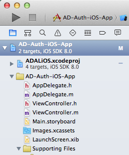
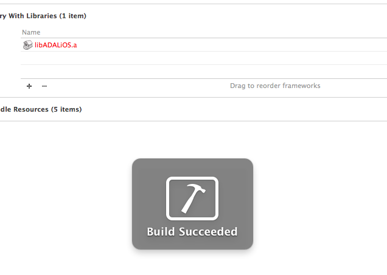
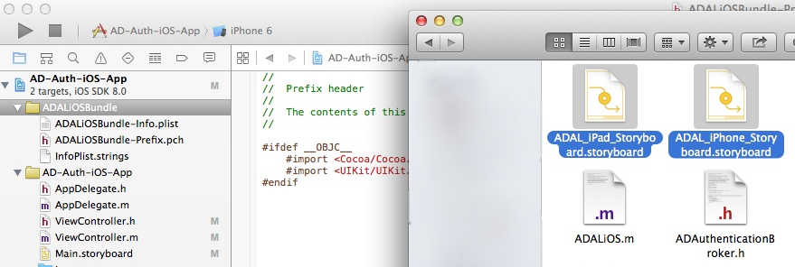
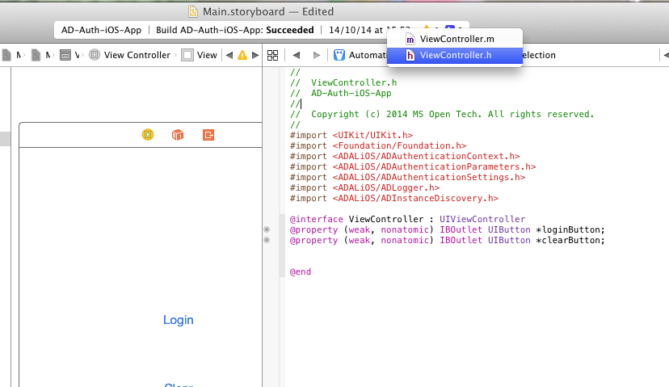
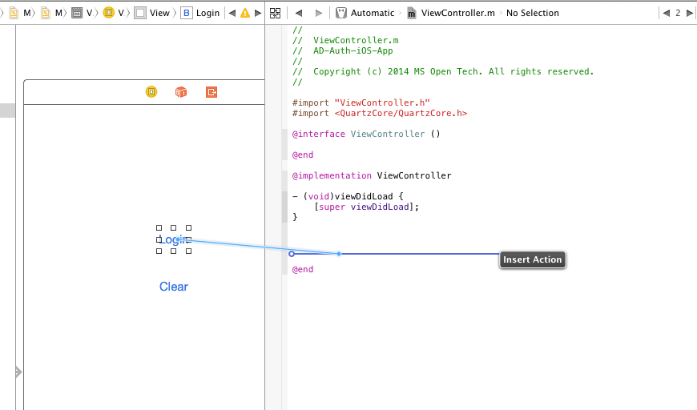

Module XX: *Authenticate to AD with iOS*
==========================

##Overview

The lab lets students configure and run an iOS App which allows the user to authenticate to an Azure ActiveDirectory account using ADALiOS library.

##Objectives

- Learn how to authenticate with Azure AD from iOS using the **Azure Active Directory AuthenticationLibrary (ADAL) for iOS**
- Learn how to get a token and store it for further requests

##Prerequisites

- Apple Macintosh environment
- XCode 6 (from the AppStore - compatible with iOS8 sdk)
- XCode developer tools (it will install git integration from XCode and the terminal)
- You must have a Windows Azure subscription to complete this lab.
- You must have completed Module 04 and linked your Azure subscription with your O365 tenant.

##Exercises

The hands-on lab includes the following exercises:

- [Create a New Project and add ADAiOS library](#exercise1)
- [Add login and clear buttons to get a token from Azure AD](#exercise2)

##Exercise 1: Create a New Project and add ADAiOS library
In this exercise you will create a New Project, download the ADALiOS library from the git repository and add it to the project.
Then check everything is ok, running the empty app.

###Task 1 - New Project
Download XCode 6 with iOS8 support, sdk and XCode developer tools.

01. Launch XCode and create a new **Sigle View Application**

    

02. Fill the inputs with the application info
     
    

03. On the Project settings (click on the root item in the file explorer)

    - Go to **build settings** with **All** option selected
    - Search for the property "Other Linker Flags"
    - Add a new flag named "-ObjC"
    - Save the changes

    
    

###Task 2 - Add ADALiOS library and bundles

01. Clone ADALiOS library from GitHub

    - Run the command: git clone https://github.com/AzureAD/azure-activedirectory-library-for-objc
    - Open the downloaded folder and copy ADALiOS folder into our project directory, for convention under a folder named "lib"
    
    

02. Import ADALiOS library into the project
    
    - Open ADALiOS folder and drag **ADALiOS.xcodeproj** into the XCode, under the project file

    

03. Under Project Settings
    
    - Go to **Build Phases**
    - Add an Item under **Target Dependencies** and select the ADALiOS library
    - Add an Item under **Link Binary with Libraries** and select the ADALiOS packed library (the file with .a extension)
    - Build the project from the menu **Project -> Build** and check if success

    
    
    
    

04. Importing ADALiOS bundle: the library comes with a bundle that is required to access the AzureAD login page

    - On Finder, look for **ADALiOSBundle** folder under the ADALiOS library in the lib directory
    - Drag this folder into the XCode, under the project file
    - Look for the storyboard files (one for iPad and one for iPhone) inside **ADALiOS** library folder
    - Drag the to files into XCode, under the newly added ADALiOSBundle folder
    - Check the files hierarchy and build the project

    
    

##Exercise 2: Create the application using storyboards and ADALiOS library
In this exercise you will add the action buttons to the application, connect them to the code and use the Login and Clear token features with ADALiOS

###Task 1 - Add buttons to the view and connect to the code

01. Using the storyboard feature, open the Main.storyboard file and add two buttons for Login and Clear actions
    
    - Also change the storyboard size to have a real reference of the screen. Do this selecting the view and changing the settings from the right panel
    
    
    
    

02. Open the **Assistant Editor** clicking the icon on the right corner of the XCode window. This will show the counterparts of a file

    - Select the **ViewController.h** file to connect the buttons
    - Right click on the buttons and drag the line to the header file of the controller.
    - Select the **ViewController.m** in the right editor to connect actions with this counterpart
    - Right click on the buttons and drag the line to the implementation file of the controller

    
    
    
    
    
    

###Task 2 - Add behaviour to the buttons and use ADALiOS methods

01. On the **ViewController.m** file add the following imports before the implementation declaration

    #import <ADALiOS/ADAuthenticationContext.h>
    #import <ADALiOS/ADAuthenticationParameters.h>
    #import <ADALiOS/ADAuthenticationSettings.h>
    #import <ADALiOS/ADLogger.h>
    #import <ADALiOS/ADInstanceDiscovery.h>

02. Inside the implementation declaration add the following variables

    ADAuthenticationContext* authContext;
    NSString* authority;
    NSString* redirectUriString;
    NSString* resourceId;
    NSString* clientId;
    NSString* token;

03. Set the variables values in the viewDidLoad method to initialize the info when the application starts

04. Call the login action with ADALiOS 

    - Add the following method to the implementation file

        -(void) getToken : (BOOL) clearCache completionHandler:(void (^) (NSString*))completionBlock;
        {
            ADAuthenticationError *error;
            authContext = [ADAuthenticationContext authenticationContextWithAuthority:authority error:&error];

            NSURL *redirectUri = [NSURL URLWithString:redirectUriString];

            if(clearCache){
                [authContext.tokenCacheStore removeAllWithError:nil];
            }

            [authContext acquireTokenWithResource:resourceId clientId:clientId redirectUri:redirectUri completionBlock:^(ADAuthenticationResult *result) {
                if (AD_SUCCEEDED != result.status){
                    // display error on the screen
                    [self showError:result.error.errorDetails];
                }
                else{
                    completionBlock(result.accessToken);
                }
            }];
        }

        -(void) showError:(NSString *)error{
            dispatch_async(dispatch_get_main_queue(), ^{
                NSString *errorMessage = [@"Login failed. Reason: " stringByAppendingString: error];
                UIAlertView *alert = [[UIAlertView alloc] initWithTitle:@"Error" message:errorMessage delegate:self cancelButtonTitle:@"Retry" otherButtonTitles:@"Cancel", nil];
                [alert show];
            });
        }

    - Add behaviour to the login action button adding the following inside the action method

        - (IBAction)loginAction:(id)sender {
            [self getToken:FALSE completionHandler:^(NSString *token){
                dispatch_async(dispatch_get_main_queue(), ^{
                    UIAlertView *alert = [[UIAlertView alloc] initWithTitle:@"Success" message:token delegate:self cancelButtonTitle:@"Ok" otherButtonTitles:nil, nil];
                    [alert show];
                });
            }];
        }

05. Call the clear action with ADALiOS

    - Add the following to the clear action button behaviour method
        
        - (IBAction)clearAction:(id)sender {
            ADAuthenticationError* error;
            id<ADTokenCacheStoring> cache = [ADAuthenticationSettings sharedInstance].defaultTokenCacheStore;
            NSArray* allItems = [cache allItemsWithError:&error];

            if (allItems.count > 0)
            {
                [cache removeAllWithError:&error];
            }

            if (error)
            {
                dispatch_async(dispatch_get_main_queue(), ^{
                    NSString *errorMessage = [@"Clear caché failed. Reason: " stringByAppendingString: error.errorDetails];
                    UIAlertView *alert = [[UIAlertView alloc] initWithTitle:@"Error" message:errorMessage delegate:self cancelButtonTitle:@"Ok" otherButtonTitles:nil, nil];
                    [alert show];
                });
                return;
            }

            NSHTTPCookieStorage* cookieStorage = [NSHTTPCookieStorage sharedHTTPCookieStorage];
            NSArray* cookies = cookieStorage.cookies;
            if (cookies.count)
            {
                for(NSHTTPCookie* cookie in cookies)
                {
                    [cookieStorage deleteCookie:cookie];
                }
            }

            dispatch_async(dispatch_get_main_queue(), ^{
                UIAlertView *alert = [[UIAlertView alloc] initWithTitle:@"Success" message:@"Cookies Cleared" delegate:self cancelButtonTitle:@"Ok" otherButtonTitles:nil, nil];
                [alert show];
            });
        }
    

##Summary

By completing this hands-on lab you have learnt:

01. Some of the basics of iOS development.

02. How to add the ADALiOS library and bundles to the application 

03. How to call login and clear operations to handle the token from an AzureAD account for further requests

